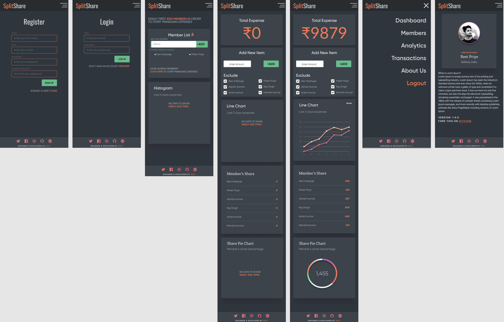

# SplitShare

> Built with the MERN stack & Redux.

## Prototype



## Features

- User authentication : Login/Register/Logout functionality
- Multi payer
- Exclude members
- Add/Delete expenses
- Add/Update expense members
- Charts for better data visualisation
- Database seeder (users, expensedata & transactions)

## Usage

### ES Modules in Node

We use ECMAScript Modules in the backend in this project. Be sure to have at least Node v14.6+ or you will need to add the "--experimental-modules" flag.

Also, when importing a file (not a package), be sure to add .js at the end or you will get a "module not found" error

You can also install and setup Babel if you would like

### Env Variables

Create a .env file in then root and add the following

```
NODE_ENV = development
PORT = 5000
MONGO_URI = your mongodb uri
JWT_SECRET = 'abc123'
```

### Install Dependencies (frontend & backend)

```
npm install
cd frontend
npm install
```

### Run

```
# Run frontend (:3000) & backend (:5000)
npm run dev

# Run backend only
npm run server
```

## Build

```
# Create frontend prod build
cd frontend
npm run build
```

### Seed Database

You can use the following commands to seed the database with some sample users, expenses and transactions as well as destroy all data
Be careful this operation is destructive.

```
# Import data
npm run data:import

# Destroy data
npm run data:destroy
```

```
Sample User Logins

reetpriye@gmail.com
Reet@1234

rajsingh@gmail.com
Raj@1234
```

## License

The MIT License

Copyright (c) 2021 Reet Priye

Permission is hereby granted, free of charge, to any person obtaining a copy
of this software and associated documentation files (the "Software"), to deal
in the Software without restriction, including without limitation the rights
to use, copy, modify, merge, publish, distribute, sublicense, and/or sell
copies of the Software, and to permit persons to whom the Software is
furnished to do so, subject to the following conditions:

The above copyright notice and this permission notice shall be included in
all copies or substantial portions of the Software.

THE SOFTWARE IS PROVIDED "AS IS", WITHOUT WARRANTY OF ANY KIND, EXPRESS OR
IMPLIED, INCLUDING BUT NOT LIMITED TO THE WARRANTIES OF MERCHANTABILITY,
FITNESS FOR A PARTICULAR PURPOSE AND NONINFRINGEMENT. IN NO EVENT SHALL THE
AUTHORS OR COPYRIGHT HOLDERS BE LIABLE FOR ANY CLAIM, DAMAGES OR OTHER
LIABILITY, WHETHER IN AN ACTION OF CONTRACT, TORT OR OTHERWISE, ARISING FROM,
OUT OF OR IN CONNECTION WITH THE SOFTWARE OR THE USE OR OTHER DEALINGS IN
THE SOFTWARE.
